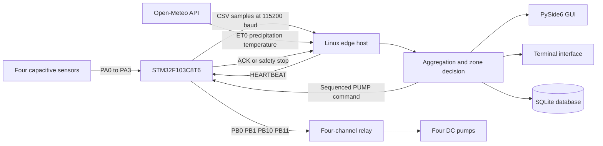

# Embedded Weather-Aware Smart Irrigation System

This repository contains a research prototype for four-zone irrigation control. The system combines soil-moisture sensing, local edge processing, a two-day weather forecast, timed pump control, a graphical interface, a terminal interface, and SQLite data logging.

> [!IMPORTANT]
> This project is source-available software. It is not open-source software. The license does not permit use, copying, modification, distribution, deployment, or commercial use without prior written permission. See [License](#license).

> [!WARNING]
> This system can operate physical pumps. Test all relay outputs with the pumps disconnected. Confirm the active relay level, wiring, power isolation, flow rates, and emergency-stop behavior before field operation.

## Contents

- [System overview](#system-overview)
- [Main functions](#main-functions)
- [Architecture](#architecture)
- [Hardware](#hardware)
- [Software structure](#software-structure)
- [Control method](#control-method)
- [Safety controls](#safety-controls)
- [Installation](#installation)
- [Firmware setup](#firmware-setup)
- [Graphical application](#graphical-application)
- [Terminal application](#terminal-application)
- [Configuration](#configuration)
- [Serial protocol](#serial-protocol)
- [Database](#database)
- [Tests](#tests)
- [Experimental context](#experimental-context)
- [Known limitations](#known-limitations)
- [License](#license)

## System overview

The prototype separates low-level acquisition and actuation from high-level control:

- An STM32F103C8T6 reads four capacitive soil-moisture sensors.
- The STM32 converts each 12-bit ADC value to a normalized value from 0% to 100%.
- The STM32 sends four separate values to the host through a 115200-baud serial link.
- A BTT Pi V1.2 or another Linux host collects the samples and calculates the decision.
- The host gets daily reference evapotranspiration and precipitation forecast data from Open-Meteo.
- The host calculates a separate water requirement for each of four equal zones.
- The host sends sequenced pump commands to the STM32.
- The STM32 controls four active-low relay outputs and applies local safety limits.
- The application stores one aggregated record for each control cycle in SQLite.

The median soil-moisture value is used for monitoring, validation, and data logging. It does not directly start a pump. Each pump starts only when its related zone is below the lower threshold and the calculated water requirement for that zone is positive.

## Main functions

- Four independent soil-moisture inputs
- Four independent irrigation zones and pump outputs
- Temporal averaging during a configurable collection window
- Median fusion of the four temporal averages
- Weather-aware water-demand calculation
- Open-Meteo forecast integration without an API key
- PySide6 desktop dashboard
- Independent terminal application
- Explicit sensor, weather, and pump simulation modes
- Plant, location, and configuration management
- SQLite cycle history, filters, CSV export, backup, restore, and retention
- Serial handshake, pump command sequence numbers, acknowledgements, and heartbeat checks
- Host and firmware pump-runtime limits
- Unit, integration, CLI, GUI, database, weather, sensor, and firmware-contract tests

## Architecture



The physical control path is:

```text
BTT Pi or Linux host -> serial command -> STM32 -> GPIO -> relay -> pump
```

## Hardware

| Component | Model or type | Function |
| --- | --- | --- |
| Edge computer | BTT Pi V1.2 or compatible Linux host | Python application, weather access, decisions, GUI, and database |
| Microcontroller | STM32F103C8T6 Blue Pill | Sensor acquisition, serial protocol, relay control, and local safety |
| Soil sensors | 4 x capacitive soil-moisture sensor V2.0 | Zone moisture input |
| Display | SSD1306 OLED, 128 x 64, I2C address `0x3C` | Local moisture and status display |
| Relay module | 4-channel, 5 V, active-low | Electrical pump switching |
| Actuators | 4 x DC water pump | Water delivery for four zones |
| Water source | Reservoir and four irrigation lines | Pump supply and distribution |

### STM32 pin map

| Function | STM32 pins |
| --- | --- |
| Soil sensors 1 to 4 | `PA0`, `PA1`, `PA2`, `PA3` |
| Relay outputs 1 to 4 | `PB0`, `PB1`, `PB10`, `PB11` |
| OLED | Hardware I2C pins for the selected STM32 board |
| Host connection | USB serial or UART serial exposed as `/dev/ttyUSB*` or `/dev/ttyACM*` |

The firmware uses an active-low relay definition. A low GPIO level turns a relay on. Verify this behavior on the actual relay module before you connect a pump.

## Software structure

```text
.
|-- app_final_gui_1/
|   |-- main.py                    # PySide6 application entry point
|   |-- app_6.0.py                 # Terminal and non-interactive entry point
|   |-- core/
|   |   |-- database.py            # SQLite schema, settings, history, backup, and export
|   |   |-- irrigation.py          # Algorithm version 2.0 and pump scheduling
|   |   |-- sensor.py              # Linux serial transport and protocol handling
|   |   `-- weather.py             # Open-Meteo access, validation, cache, and simulation
|   `-- gui/
|       |-- main_window.py          # Main cycle controller and safety workflow
|       |-- pages/                  # Dashboard, plants, locations, weather, irrigation, history, settings
|       `-- widgets/                # Reusable cards, gauges, and notifications
|-- soil_moisture_final_stm/
|   `-- soil_moisture_10.ino        # STM32 firmware
|-- tests/                          # Automated test suite
|-- requirements.txt
|-- .gitignore
|-- LICENSE
`-- README.md
```

## Control method

The current host implementation identifies itself as algorithm version `2.0`.

### 1. Sensor acquisition and aggregation

When sensing is enabled, the STM32 sends one four-value sample every 2 seconds. The default host collection window is 60 seconds. The host rejects invalid values and requires at least three valid samples by default.

For sensor `i`, the host calculates the temporal average:

$$
\bar{M}_i = \frac{1}{n}\sum_{k=1}^{n}M_{i,k}
$$

The host sorts the four averages. It calculates the median as:

$$
M_{median}=\frac{\bar{M}_{(2)}+\bar{M}_{(3)}}{2}
$$

The four averages remain separate for zone control.

### 2. Zone water requirement

The code divides the configured total area `A` into four equal zones:

$$
A_z=\frac{A}{4}
$$

The target moisture is the midpoint between the lower and upper plant thresholds:

$$
T=\frac{L+U}{2}
$$

For each dry zone, the code calculates:

$$
V_z=A_z \times d \times 1000
$$

$$
S_i=\max(0,\frac{T-M_i}{100}) \times V_z \times C_s
$$

$$
E_i=ET_0 \times K_c \times A_z
$$

$$
R_i=(R_0+R_1) \times \eta_r \times A_z
$$

$$
Q_i=\frac{\max(0,S_i+E_i-R_i)}{\eta_i}
$$

Where:

| Symbol | Meaning | Unit |
| --- | --- | --- |
| `M_i` | Temporal average for zone `i` | % |
| `L`, `U` | Lower and upper plant thresholds | % |
| `d` | Root-zone or container depth | m |
| `C_s` | Calibrated soil-water capacity | fraction |
| `ET0` | Current-day reference evapotranspiration from the API | mm/day |
| `Kc` | Crop coefficient | dimensionless |
| `R0`, `R1` | Forecast precipitation for the current and next calendar day | mm |
| `eta_r` | Effective-rainfall factor | fraction |
| `eta_i` | Irrigation efficiency | fraction |
| `Q_i` | Planned water for zone `i` | L |

Because 1 mm over 1 square metre equals 1 litre, the evapotranspiration and rainfall terms produce litres after multiplication by zone area.

Temperature values are validated, displayed, and stored. They are not direct terms in the decision formula. They can affect the result indirectly through the `ET0` value from the weather service.

### 3. Pump decision and timing

A zone is eligible for irrigation only when:

```text
zone moisture < lower threshold AND calculated zone water > 0
```

The requested pump time is:

$$
t_i=\frac{Q_i}{F_i}
$$

`F_i` is the configured pump flow in litres per minute. The controller does not start a pump for a requested duration below 1 second. It limits each requested duration to 30 minutes.

Pump operation is time-based. The system stops each pump when its calculated duration expires. The system does not keep the moisture sensor stream active to stop a pump at a measured upper threshold during the same irrigation event.

### 4. Normal cycle

1. The host sends `SENSOR:START`.
2. The host collects samples for the configured duration.
3. The host sends `SENSOR:STOP`.
4. The host calculates four averages and one median.
5. The host obtains or reuses validated weather data.
6. The host calculates the four zone requirements.
7. The host stores one aggregated cycle record.
8. If irrigation is required, the host sends a sequenced pump command.
9. The host requires a matching acknowledgement.
10. The host sends a heartbeat every 5 seconds while a pump is active.
11. The host stops each pump at its scheduled time.
12. The host stores the estimated delivered volume and final execution status.
13. The host waits for the configured cycle interval.

## Safety controls

The implementation contains the following software safety controls:

- Real non-interactive operation requires the `--yes` option.
- Interactive real operation requires the exact confirmation text `RUN`.
- The host has an explicit pump-command gate.
- Each `PUMP` command has a sequence number and requires a matching acknowledgement.
- The host sends a heartbeat every 5 seconds during irrigation.
- The STM32 stops all pumps if no control heartbeat arrives for 15 seconds.
- The STM32 stops all pumps after 30 minutes of continuous operation.
- The host also caps each schedule at 30 minutes.
- Stop, emergency stop, application close, command failure, and worker failure all request an all-off pump state.
- Missing or invalid sensor data stops the cycle.
- Weather failure stops the cycle unless simulated weather was explicitly enabled.

These controls reduce risk. They do not replace electrical protection, fuses, dry-run protection, overflow detection, independent watchdog hardware, or operator supervision.

## Installation

### Requirements

- Python 3.10 or later
- Linux for real serial-device operation
- `stty`, which is normally available through the Linux core utilities
- PySide6 6.7 or later for the GUI
- Internet access for live Open-Meteo forecasts
- The hardware listed in [Hardware](#hardware) for physical operation

The terminal application can run without PySide6. Simulation mode does not require the STM32, relays, or pumps.

### Linux setup

The following commands are for users who have written permission from the copyright holder. After you clone the repository and enter its root directory, run:

```bash
python3 -m venv .venv
source .venv/bin/activate
python -m pip install --upgrade pip
python -m pip install -r requirements.txt
```

The program creates `app_final_gui_1/irrigation_system.db` when the database does not exist. Do not copy a database, WAL file, virtual environment, or cache directory from another computer.

### Serial access

The host searches for the first `/dev/ttyUSB*` or `/dev/ttyACM*` device when the port setting is `auto`. You can also set an explicit device path. The user account must have permission to read and write the device.

The current real-device transport uses Linux device paths and the `stty` command. On Windows or macOS, use simulation mode unless you adapt the serial transport.

## Firmware setup

The firmware file is `soil_moisture_final_stm/soil_moisture_10.ino`.

1. Use an Arduino-compatible STM32 toolchain for the STM32F103C8T6.
2. Install the `Adafruit GFX Library` and `Adafruit SSD1306` library.
3. Select settings that support 12-bit ADC reads and the STM32 pin names used by the sketch.
4. Confirm that the OLED address is `0x3C`.
5. Disconnect all pumps.
6. Upload the firmware.
7. Confirm the `PONG:STM32_IRRIGATION_V1` handshake.
8. Test each relay output and confirm the active-low polarity.
9. Calibrate each moisture sensor in the actual soil and installation.
10. Measure each pump flow and update the four host flow settings.

The firmware contains these initial sensor calibration values:

```cpp
dry_thresholds = {3000, 3000, 3000, 3000};
wet_thresholds = {1200, 1200, 1200, 1200};
```

These values are installation defaults. They are not universal calibration values.

## Graphical application

Start the GUI from the repository root:

```bash
python app_final_gui_1/main.py
```

The GUI contains these pages:

| Page | Function |
| --- | --- |
| Dashboard | Live moisture, weather source, decision, and pump state |
| Plants | Plant selection and crop coefficient and threshold management |
| Locations | Latitude and longitude management and active location selection |
| Weather | Two-day forecast display and manual refresh |
| Irrigation | Start, stop, restart, emergency stop, and progress |
| History | Latest records, filters, details, and CSV export |
| Settings | Serial, timing, weather, flow, efficiency, theme, backup, and restore |

Before the first real cycle:

1. Add and select a location.
2. Select or add a plant.
3. Set the area and soil depth.
4. Set the four measured pump flow rates.
5. Set the serial port and baud rate.
6. Keep simulated weather disabled for real operation.
7. Start the analysis and review the confirmation dialog.

## Terminal application

Start the interactive menu:

```bash
python app_final_gui_1/app_6.0.py
```

Show all command options:

```bash
python app_final_gui_1/app_6.0.py --help
```

Run one software-only cycle:

```bash
python app_final_gui_1/app_6.0.py --run --simulate --simulate-weather \
  --soil 20,50,50,50 --location "Rasht"
```

Run three deterministic simulated cycles with a 5-second interval:

```bash
python app_final_gui_1/app_6.0.py --run --simulate --simulate-weather \
  --cycles 3 --interval 5 --location "Rasht"
```

List saved plants and locations:

```bash
python app_final_gui_1/app_6.0.py --list-plants
python app_final_gui_1/app_6.0.py --list-locations
```

Show the ten latest records:

```bash
python app_final_gui_1/app_6.0.py --history 10
```

Real non-interactive operation needs explicit confirmation:

```bash
python app_final_gui_1/app_6.0.py --run --yes --location "Rasht"
```

Do not use `--yes` until you complete the disconnected-pump safety test.

## Configuration

| Setting | Default | Meaning |
| --- | ---: | --- |
| Serial port | `auto` | First compatible Linux serial device |
| Baud rate | `115200` | Host-to-STM32 serial rate |
| Collection duration | 60 s | Sample window for each cycle |
| Cycle interval | 300 s | Wait after a completed cycle |
| Minimum samples | 3 | Minimum valid four-value samples |
| Weather refresh | 1 h | In-memory forecast cache period |
| Simulated weather | Disabled | Explicit fallback permission |
| Pump flows | 1.6 L/min each | Initial estimates, not measurements |
| Maximum pump runtime | 30 min | Host schedule limit |
| Irrigation efficiency | 0.85 | Water-demand correction factor |
| Soil-water capacity | 0.20 | Calibrated storage factor |
| Rainfall efficiency | 0.80 | Effective fraction of forecast rain |
| Land area | 4.0 m2 | Total area divided into four equal zones |
| Cultivation mode | `Field` | Stored mode label |
| Soil depth | 0.20 m | Root-zone or container depth |
| History retention | 365 days | Automatic record-retention period |

`Field` and `Container` currently use the same calculation. The mode changes labels and stored metadata. Soil depth remains an active numeric input in both modes.

## Serial protocol

All commands and replies are ASCII lines terminated by a newline.

| Direction | Message | Purpose |
| --- | --- | --- |
| Host to STM32 | `PING` | Request device identity |
| STM32 to host | `PONG:STM32_IRRIGATION_V1` | Confirm compatible firmware |
| Host to STM32 | `SENSOR:START` | Enable sensor streaming |
| STM32 to host | `SENSOR ON` | Confirm sensor start |
| Host to STM32 | `SENSOR:STOP` | Disable sensor streaming |
| STM32 to host | `SENSOR OFF` | Confirm sensor stop |
| STM32 to host | `s1,s2,s3,s4` | Four normalized moisture values |
| Host to STM32 | `PUMP:<sequence>:0,1,0,1` | Set four pump states |
| STM32 to host | `PUMP OK:<sequence>:0,1,0,1` | Confirm the matching state command |
| Host to STM32 | `HEARTBEAT` | Refresh the command watchdog |
| STM32 to host | `HEARTBEAT OK` | Confirm the heartbeat |
| STM32 to host | `SAFETY STOP:WATCHDOG` | Report lost-heartbeat shutdown |
| STM32 to host | `SAFETY STOP:MAX_RUNTIME` | Report continuous-runtime shutdown |

## Database

The application uses SQLite schema version 2. It creates these tables:

- `irrigation_records`: one aggregated row for each completed decision cycle
- `plants`: plant name, `Kc`, lower threshold, and upper threshold
- `locations`: location name, latitude, and longitude
- `settings`: JSON-encoded application settings

Each current-version cycle record can contain:

- Four sensor temporal averages and their median
- Sample count and collection timestamps
- Weather values, weather source, and validated payload
- Plant, location, area, depth, and cultivation mode
- Planned water before and after effective rainfall
- Pump states, scheduled times, flow settings, and acknowledgement state
- Estimated delivered volume and final execution status
- Algorithm version and threshold snapshot

Raw 2-second sensor samples, heartbeat events, and every pump state transition are not stored as separate database rows.

The database can contain precise locations, device configuration, and unpublished experimental results. For this reason, runtime databases and exports are excluded by `.gitignore`.

## Tests

Run the full suite from the repository root:

```bash
python -m unittest discover -s tests -v
```

The suite covers:

- Irrigation equations, units, zones, runtime limits, and invalid input
- Sensor parsing, aggregation, command gating, acknowledgements, and safety stops
- Weather validation, cache behavior, and explicit simulation permission
- Database schema migration, typed settings, records, backup, restore, and export
- GUI construction and signal updates when PySide6 is installed
- Terminal workflows and subprocess execution
- End-to-end simulated control flow
- Host and firmware protocol agreement

Current local verification on 7 September 2026: 72 tests ran, 69 passed, and 3 GUI tests were skipped because PySide6 was not installed in the verification runtime.

## Experimental context

The associated manuscript describes a radish cultivation experiment from 13 June to 13 July 2026. The research dataset reviewed for this documentation contained 38,112 stored legacy records for this interval. The dataset and manuscript working files are not included in this repository.

The manuscript reports:

- Mean median soil moisture: 47.93%
- Standard deviation: 3.84 percentage points
- Recorded range: 32.2% to 54.0%
- Configured radish thresholds: 40% and 65%
- Three recorded irrigation decisions
- Stored planned legacy volumes: 11.93 L, 7.37 L, and 7.38 L
- Total stored planned legacy volume: 26.68 L
- Approximately 12.46 and 12.48 percentage-point moisture increases after two events with usable pre-event baselines

These results have strict limits:

- The records identify the algorithm as `legacy`, not version `2.0` in the current code.
- The stored planned volumes are not measurements from a flow meter.
- The legacy records do not contain pump acknowledgement or state telemetry.
- The database does not prove physical actuation for the three legacy decisions.
- The study did not include a parallel timer-based control group.
- The results do not establish a water-saving percentage, yield improvement, or water productivity.
- The two short-term moisture changes show a temporal association with recorded decisions. They do not independently prove actuator performance.

The current version 2.0 algorithm must be evaluated in a new controlled experiment before its results are compared with the legacy dataset.

## Known limitations

- Real serial operation is Linux-specific in the current implementation.
- The system has four fixed zones and assumes equal zone area.
- `Field` and `Container` are metadata modes and use the same formula.
- The weather cache is only in memory.
- A forecast request failure stops a real cycle unless simulation was explicitly permitted.
- The rainfall input is the sum of the current and next calendar day. It is not a strict rolling 48-hour forecast.
- The program trusts forecast precipitation. It does not use a rain gauge or observed-weather endpoint.
- Pump operation is time-based during each irrigation event.
- Pump flow and delivered volume are estimates until each line is calibrated or a flow meter is added.
- Moisture percentages depend on fixed linear dry and wet calibration values in the firmware.
- The current repository does not include a reproducible hardware build definition or electronic schematic.
- Physical field tests remain necessary after every wiring, calibration, firmware, or control change.

## License

Copyright is reserved. This repository uses the [Proprietary Source-Available License](LICENSE). It does not grant an open-source license.

You must get prior written permission from the copyright holder before you use, execute, copy, modify, distribute, publish, deploy, sublicense, sell, or include this project in another product, service, paper implementation, dataset, model, or commercial activity.

Public access to a GitHub repository still allows the platform functions that GitHub requires, including viewing and forking within GitHub. If source confidentiality is required, keep the repository private and give access only to approved users.

Third-party libraries and services keep their own terms and licenses. This project license does not replace those terms.

## Manuscript reference

The associated manuscript uses the following title and author list:

```text
An Embedded Industrial Irrigation System with Weather-Integrated Intelligent Scheduling
Kiarash Zangooei, Arya Masoudpay, and Hamid Reza Ghaeini
2026 manuscript
```

Publication status, final bibliographic data, and reuse permission must be confirmed with the copyright holder before citation or reuse.
